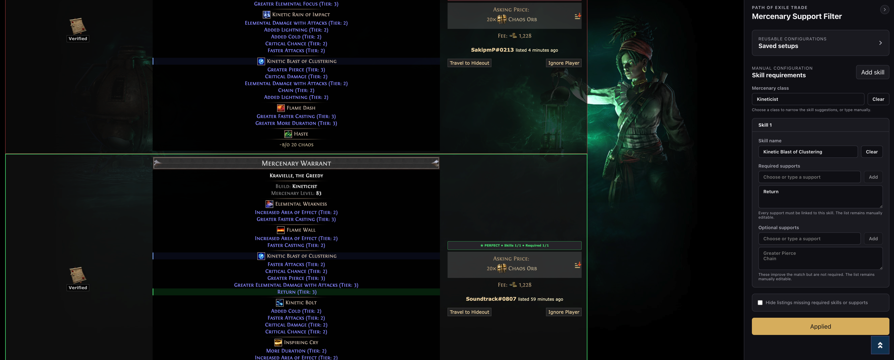

# PoE Merc Finder

PoE Merc Finder is a Chrome extension that adds linked-support filtering to
mercenary searches on the [Path of Exile Trade](https://www.pathofexile.com/trade)
website.

The trade site can find mercenaries that have a particular skill or support
gem, but it cannot require those supports to be linked to a specific skill. This extensions allows you to high-light matching patterns.



## Features

- Filter mercenaries by skill and the support gems linked to that skill.
- Separate required supports from optional, nice-to-have supports.
- Highlight matching skills and supports directly in each trade listing.
- Mark listings as perfect matches, partial matches, or failures and show match
  counts.
- Optionally hide listings that are missing required skills or supports.
- Choose mercenary classes, skills, and support gems from suggestions while
  retaining manual input as a fallback.
- Save configurations locally under custom names, then load, update, or delete
  them later.
- Collapse the extension panel when it is not needed.
- Automatically move alongside the Better Trading panel when both extensions
  are active.

## Usage

1. Open a mercenary search on the Path of Exile Trade website.
2. Open the PoE Merc Finder panel on the right side of the page.
3. Optionally choose a mercenary class to narrow the skill suggestions.
4. Add one or more skills and enter their required or optional linked supports.
5. Select **Apply filters** to evaluate the visible trade listings.
6. Optionally give the configuration a name and select **Save current** to use
   it again later.

Saved setups and panel preferences are stored locally by the extension. They
are not transmitted to an external service.

See the [privacy policy](PRIVACY.md) for complete details about local data
handling and extension permissions.

## Development

The extension is built with [WXT](https://wxt.dev/), React, and TypeScript.
Install dependencies and start the Chrome development build with:

```sh
pnpm install
pnpm dev
```

Load the generated `.output/chrome-mv3` directory as an unpacked extension from
`chrome://extensions`, with **Developer mode** enabled.

Useful commands:

```sh
pnpm lint       # Check source formatting and lint rules
pnpm compile    # Run TypeScript without emitting files
pnpm build      # Create a production Chrome build
pnpm zip        # Create the Chrome Web Store upload archive
pnpm data:update
```

## Mercenary data

The checked-in `data/mercenaries.json` file contains mercenary classes and
skill pools parsed from [PoE Wiki](https://www.poewiki.net/wiki/Mercenary), plus
exact support labels from the official
[Path of Exile trade metadata](https://www.pathofexile.com/api/trade/data/stats).

Run `pnpm data:update` to refresh the dataset after either source changes. The
generator validates minimum class and support counts before replacing the JSON
file, so a source markup change fails instead of silently producing an empty
dataset.

## Disclaimer
This extension is not affiliated with, endorsed by, 
or associated with Grinding Gear Games
